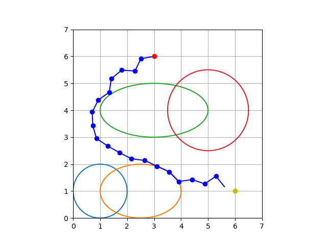
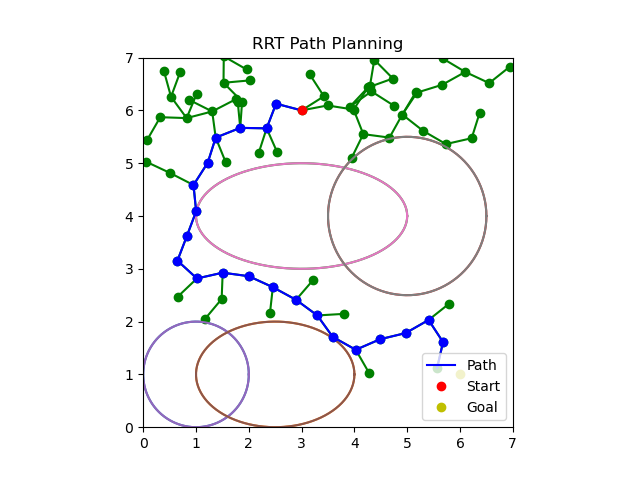

# Rapidly-exploring Random Trees (RRT)

**A pathplanning algorithm.**


To implement RRT, your scenario is:
1. You have a playfield with number of obstacles.
2. You have starting point and end point (goal).
3. You want to move from starting point to end point step by step, each step of being certain distance.

The algorithm for RRT is:
1. Initialize the start point as the first node.
2. Select a random point in the playfield.
3. Select a node which is closest to the random point.
4. Move a predetermined step from that node towards the random point.
5. If taking random step touches obstacles, repeat from step 2.
6. Is the new point close to goal? If yes stop.
7. Is the total number of iteration reaches max_iterations? If yes stop.
8. Go to step 2.

## Run
To test RRT algorithm mentioned here:

```
    python3 RRT.py
```

## Outputs

One output of RRT looked as follows:


RRT full path exploration tree is as shown below.
